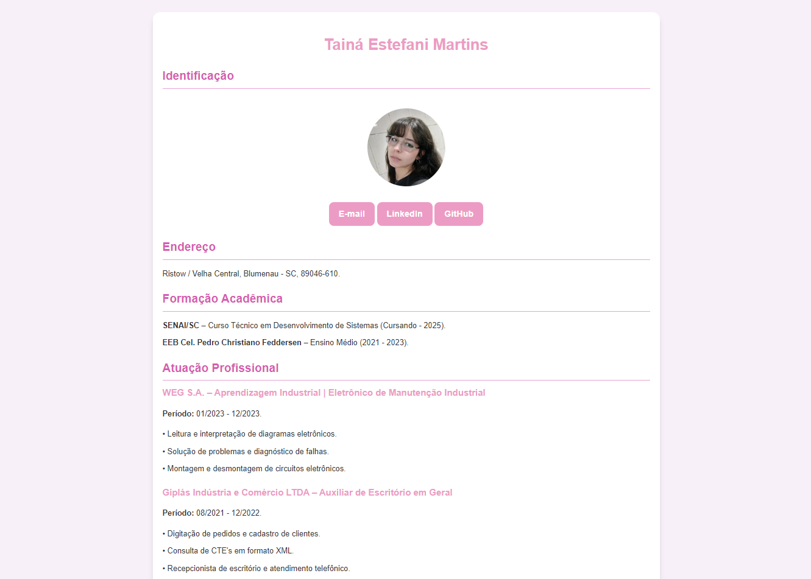
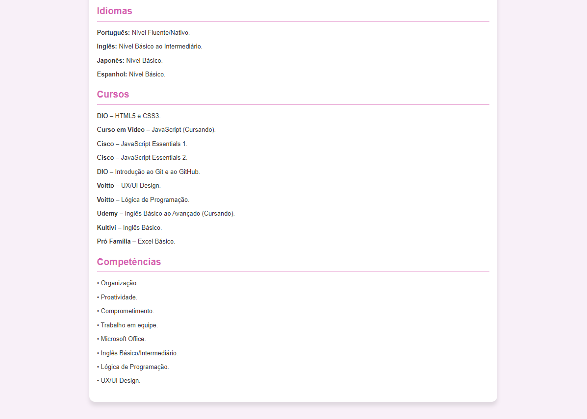

# 💼 Currículo em HTML
Este projeto é uma página web simples que apresenta meu currículo. Desenvolvido utilizando HTML e CSS, ele destaca minhas habilidades, experiências e educação de forma clara e organizada. Além de ser uma maneira prática de compartilhar meu currículo, este projeto é uma maneira de demonstrar minhas habilidades em desenvolvimento web.

## ⚙️ Tecnologias Utilizadas
* HTML.
* CSS.
* Visual Studio Code.

## 🔨 Funcionalidades
- **Design Responsivo:** A página é adaptável a diferentes tamanhos de tela, garantindo uma boa visualização em dispositivos móveis e desktops.
- **Estrutura Simples e Limpa:** A estrutura do código HTML é clara e fácil de entender, seguindo boas práticas de desenvolvimento.
- **Estilo Personalizado com CSS:** Usei CSS para personalizar a aparência do currículo, aplicando estilos que refletem minha personalidade e profissionalismo.

## 🔧 Abrir e Executar o Projeto
* Clone este repositório com o comando:
```
git clone <https://github.com/tainaestefani/profile-card.git>
```
* Abra em uma IDE de sua escolha e clique em "Run" / "Execute" / "Go Live" para executar.

## 📱 Demonstração
<div align="center">
  
  
</div>

## 🧑‍💻 Autor
[<br><sub>Tainá Estefani Martins</sub>](https://github.com/tainaestefani)

## License
The MIT License (MIT).
